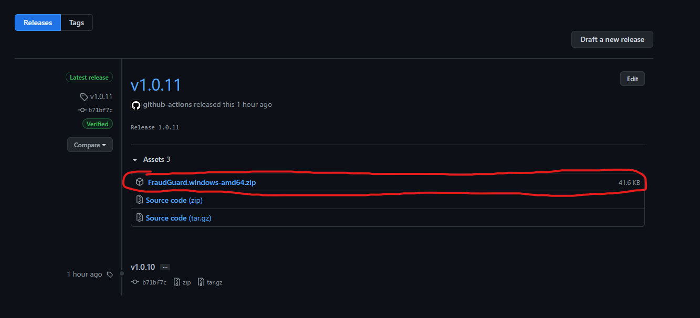
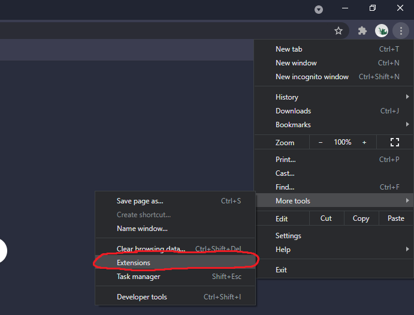

### **1**

Als Erstes besuchst du die Seite unseres Repositories, indem du den Link "https://github.com/FraudGuard/FraudGuard" in deinem Browser aufrufst.

### **2**

Um die Chrome-Erweiterung zu deinem Browser hinzuzufügen, musst du diese erst herunterladen. Dies machst du, indem du auf die neuste Version klickst.

### **3**

Hier musst du nun die Version für dein Betriebssystem herunterladen. Anschließend musst du die heruntergeladene Datei jetzt noch entpacken.

### **4**

Jetzt gehst du in deinen Chromebrowser und drückst oben rechts auf das Burger-Menü(⋮) -> Weitere Tools -> Erweiterungen.

### **5**

Nun musst du noch den "Entwicklermodus" aktivieren, weil unsere App noch nicht im Chrome Store veröffentlicht ist.

### **6**

Hier angekommen, klickst du dann auf "Entpackte Erweiterung laden" und wählst den dist-Ordner aus. Die Chrome-Erweiterung sollte jetzt geladen und einsatzbereit sein.

